# Enterprise Multi-Cloud Architecture Diagram

## System Architecture Overview


## Detailed Infrastructure Diagram

```mermaid
graph TB
    subgraph "Internet Layer"
        USERS[👥 Enterprise Users<br/>Developers & DevOps Teams]
        DNS[🌐 DNS Resolution<br/>Route 53 / Azure DNS]
    end
    
    subgraph "AWS Primary Region - us-east-1"
        subgraph "Public Subnet - 10.0.1.0/24"
            ALB[⚖️ Application Load Balancer<br/>SSL: *.company.com<br/>Health Check: /api/health]
            NAT[🚪 NAT Gateway<br/>Outbound Internet Access]
        end
        
        subgraph "Private Subnet - 10.0.2.0/24"
            EC2[🖥️ EC2 Instance<br/>Type: t3.small<br/>OS: Ubuntu 22.04<br/>Gitea v1.21.5]
            JENKINS_AWS[🤖 Jenkins Master<br/>Type: t3.medium<br/>Plugins: Terraform, Ansible]
        end
        
        subgraph "Database Subnet - 10.0.3.0/24"
            RDS[🗄️ RDS MySQL 8.0<br/>Instance: db.t3.small<br/>Multi-AZ: Enabled<br/>Backup: 7 days]
        end
        
        subgraph "Management"
            VPN_AWS[🔐 VPN Gateway<br/>IPsec Tunnel<br/>BGP: Enabled]
            CW[📊 CloudWatch<br/>Metrics & Logs<br/>Alarms: 15 configured]
        end
    end
    
    subgraph "Secure Network Tunnel"
        TUNNEL[🔒 IPsec VPN Tunnel<br/>Encryption: AES-256<br/>Authentication: SHA-256<br/>Bandwidth: 1 Gbps]
    end
    
    subgraph "Azure DR Region - East US"
        subgraph "Public Subnet - 10.1.1.0/24"
            LB_AZ[⚖️ Azure Load Balancer<br/>SKU: Standard<br/>Health Probe: TCP/3000]
            PIP[📍 Public IP<br/>Static Assignment<br/>Zone Redundant]
        end
        
        subgraph "Private Subnet - 10.1.2.0/24"
            VM_AZ[🖥️ Virtual Machine<br/>Size: Standard_B2s<br/>OS: Ubuntu 22.04<br/>State: Deallocated*]
            JENKINS_AZ[🤖 Jenkins Agent<br/>Size: Standard_B2ms<br/>Azure DevOps Integration]
        end
        
        subgraph "Database Subnet - 10.1.3.0/24"
            MYSQL_AZ[🗄️ MySQL Flexible Server<br/>SKU: Burstable B1ms<br/>Replication: Slave<br/>Lag: < 1 second]
        end
        
        subgraph "Management"
            VPN_AZ[🔐 VPN Gateway<br/>SKU: VpnGw1<br/>Active-Standby]
            MONITOR_AZ[📊 Azure Monitor<br/>Log Analytics<br/>Application Insights]
        end
    end
    
    subgraph "External Services"
        GITHUB[📦 GitHub<br/>Source Code Repository<br/>Webhook Integration]
        SLACK[💬 Slack<br/>Alert Notifications<br/>Incident Management]
        EMAIL[📧 Email<br/>SMTP Notifications<br/>Escalation Policies]
    end
    
    %% User Flow
    USERS --> DNS
    DNS --> ALB
    ALB --> EC2
    EC2 --> RDS
    
    %% Management Flow
    JENKINS_AWS --> EC2
    JENKINS_AZ --> VM_AZ
    GITHUB --> JENKINS_AWS
    GITHUB --> JENKINS_AZ
    
    %% Network Flow
    VPN_AWS <--> TUNNEL
    TUNNEL <--> VPN_AZ
    
    %% Replication Flow
    RDS -.->|"Binlog Replication<br/>< 1 sec lag"| MYSQL_AZ
    
    %% Monitoring Flow
    EC2 --> CW
    VM_AZ --> MONITOR_AZ
    CW --> SLACK
    CW --> EMAIL
    MONITOR_AZ --> SLACK
    
    %% Failover Flow (Dashed - Emergency Only)
    USERS -.->|"Failover Traffic"| LB_AZ
    LB_AZ -.->|"Emergency Route"| VM_AZ
    VM_AZ -.->|"Promoted Master"| MYSQL_AZ
    
    %% Styling
    classDef aws fill:#FF9900,stroke:#232F3E,stroke-width:3px,color:#fff,font-weight:bold
    classDef azure fill:#0078D4,stroke:#ffffff,stroke-width:3px,color:#fff,font-weight:bold
    classDef network fill:#34495E,stroke:#2C3E50,stroke-width:2px,color:#fff
    classDef external fill:#27AE60,stroke:#229954,stroke-width:2px,color:#fff
    classDef users fill:#8E44AD,stroke:#7D3C98,stroke-width:2px,color:#fff
    classDef critical fill:#E74C3C,stroke:#C0392B,stroke-width:3px,color:#fff
    
    class ALB,EC2,RDS,JENKINS_AWS,VPN_AWS,CW,NAT aws
    class LB_AZ,VM_AZ,MYSQL_AZ,JENKINS_AZ,VPN_AZ,MONITOR_AZ,PIP azure
    class TUNNEL network
    class GITHUB,SLACK,EMAIL external
    class USERS,DNS users
    class RDS,MYSQL_AZ critical
```



## Network Security Architecture

```mermaid
graph LR
    subgraph "Security Perimeter"
        subgraph "AWS Security Controls"
            WAF[🛡️ AWS WAF<br/>OWASP Top 10<br/>Rate Limiting<br/>Geo Blocking]
            
            SG_WEB[🚪 Web Security Group<br/>Port 80/443: 0.0.0.0/0<br/>Port 22: Admin IPs only]
            
            SG_APP[🚪 App Security Group<br/>Port 3000: From ALB only<br/>Port 22: Bastion only]
            
            SG_DB[🚪 DB Security Group<br/>Port 3306: App tier only<br/>No direct internet access]
        end
        
        subgraph "Network Tunnel Security"
            IPSEC[🔐 IPsec VPN<br/>IKEv2 Protocol<br/>AES-256 Encryption<br/>SHA-256 Authentication<br/>PFS: DH Group 14]
        end
        
        subgraph "Azure Security Controls"
            NSG_WEB[🚪 Web NSG<br/>HTTP/HTTPS: Internet<br/>SSH: Admin subnet only]
            
            NSG_APP[🚪 App NSG<br/>Port 3000: From LB only<br/>SSH: Jump host only]
            
            NSG_DB[🚪 DB NSG<br/>MySQL: App subnet only<br/>Replication: VPN tunnel]
        end
    end
    
    subgraph "Data Protection"
        ENCRYPT_TRANSIT[🔒 Encryption in Transit<br/>TLS 1.3<br/>Perfect Forward Secrecy]
        
        ENCRYPT_REST[🔒 Encryption at Rest<br/>AWS KMS<br/>Azure Key Vault<br/>AES-256]
        
        BACKUP[💾 Backup Encryption<br/>Point-in-time Recovery<br/>Cross-region Replication]
    end
    
    %% Security Flow
    WAF --> SG_WEB
    SG_WEB --> SG_APP
    SG_APP --> SG_DB
    
    SG_DB <--> IPSEC
    IPSEC <--> NSG_DB
    NSG_DB --> NSG_APP
    NSG_APP --> NSG_WEB
    
    %% Data Protection
    SG_DB --> ENCRYPT_TRANSIT
    NSG_DB --> ENCRYPT_TRANSIT
    ENCRYPT_TRANSIT --> ENCRYPT_REST
    ENCRYPT_REST --> BACKUP
    
    classDef security fill:#E74C3C,stroke:#C0392B,stroke-width:2px,color:#fff
    classDef encryption fill:#9B59B6,stroke:#8E44AD,stroke-width:2px,color:#fff
    
    class WAF,SG_WEB,SG_APP,SG_DB,NSG_WEB,NSG_APP,NSG_DB security
    class IPSEC,ENCRYPT_TRANSIT,ENCRYPT_REST,BACKUP encryption
```



## Disaster Recovery Flow

```mermaid
sequenceDiagram
    participant M as Monitoring System
    participant O as Operations Team
    participant J as Jenkins Azure
    participant T as Terraform
    participant A as Ansible
    participant I as Azure Infrastructure
    participant D as DNS Provider
    participant U as End Users
    
    Note over M: Continuous Health Monitoring
    M->>M: AWS Health Check Fails (3 consecutive)
    M->>O: 🚨 CRITICAL: AWS Primary Down
    
    Note over O: Decision Point (2 min)
    O->>O: Validate AWS Status Page
    O->>O: Check Azure MySQL Replication Status
    O->>O: Confirm Failover Authorization
    
    Note over O,J: Failover Activation (15 min)
    O->>J: Trigger "Azure-Failover-Pipeline"
    J->>T: terraform apply -var="mode=failover"
    T->>I: Deploy VM + Load Balancer + NSG
    T-->>J: Infrastructure Ready ✅
    
    J->>A: ansible-playbook -i inventory failover.yml
    A->>I: Install Gitea + Configure MySQL Connection
    A-->>J: Application Ready ✅
    
    Note over O,D: DNS Cutover (2 min)
    O->>D: Update A Record: gitea.company.com
    D->>D: TTL Propagation (300 seconds)
    
    Note over O,I: Database Promotion (1 min)
    O->>I: SSH to Azure MySQL
    O->>I: STOP SLAVE; RESET SLAVE ALL;
    I-->>O: MySQL Promoted to Master ✅
    
    Note over U: Service Restoration
    U->>D: DNS Resolution
    D-->>U: Azure Load Balancer IP
    U->>I: HTTP Request to Gitea
    I-->>U: Service Available ✅
    
    Note over M: Post-Failover Monitoring
    M->>I: Health Check: Azure Gitea
    M->>O: 📊 RTO Achieved: 20 minutes
    M->>O: 📊 RPO Achieved: < 1 second
```

## Cost Optimization Model


## Key Metrics Dashboard

| **Metric** | **Current** | **Target** | **Status** |
|------------|-------------|------------|------------|
| **Availability SLA** | 99.7% | 99.9% | 🟡 Improving |
| **RTO (Recovery Time)** | 18 min | 15 min | 🟢 On Track |
| **RPO (Data Loss)** | < 1 sec | < 500ms | 🟢 Exceeds Target |
| **Monthly Cost** | $165 | $150 | 🟡 Optimizing |
| **Security Score** | 92% | 95% | 🟡 Enhancing |

---

**Architecture Standards**: Enterprise-grade multi-cloud infrastructure following AWS Well-Architected Framework and Azure Cloud Adoption Framework principles.

**Compliance**: SOC 2 Type II, ISO 27001, PCI DSS Level 1 compatible design with comprehensive audit trails and security controls.

**Last Updated**: December 2024 | **Version**: 2.0 | **Owner**: Enterprise Architecture Team