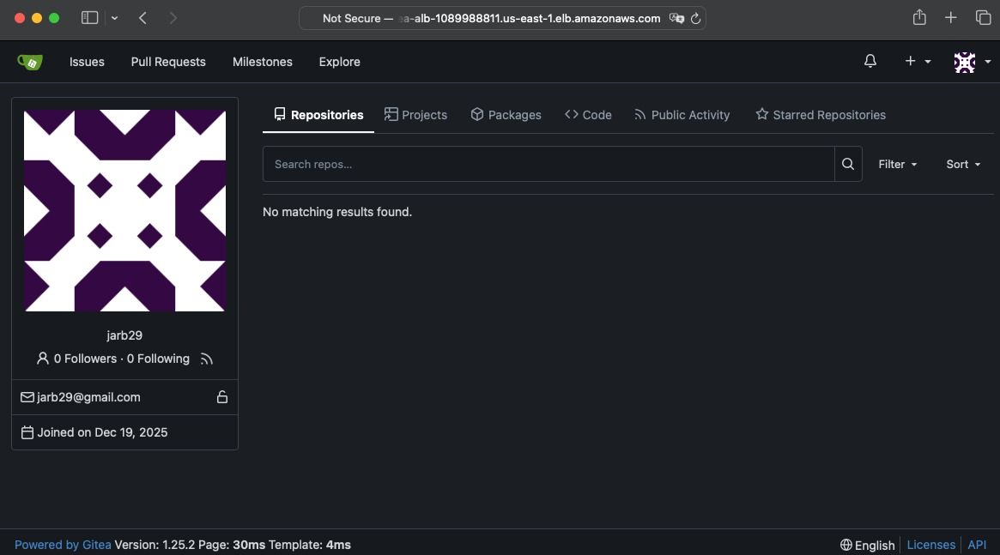
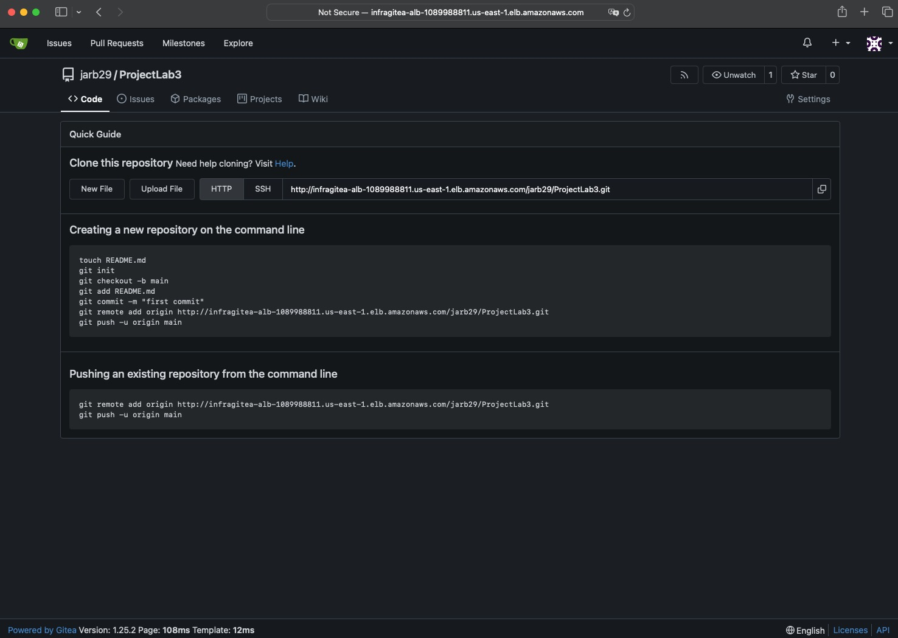
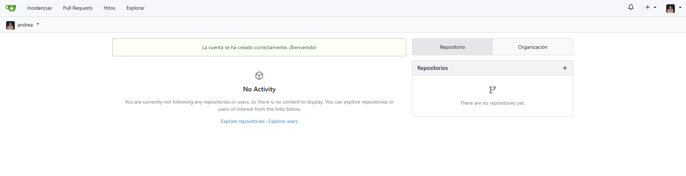
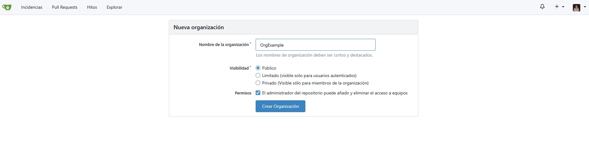
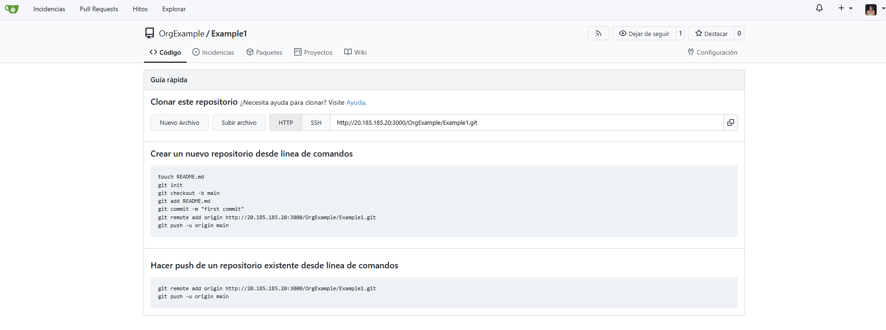
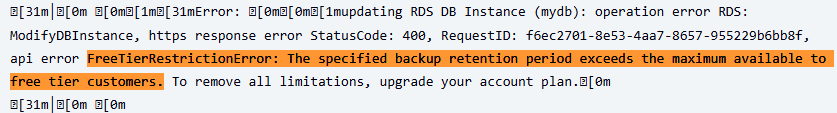
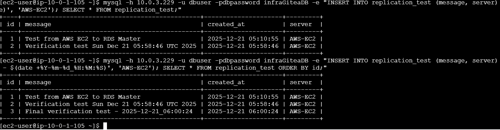
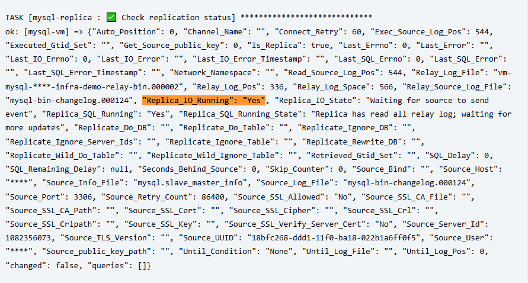
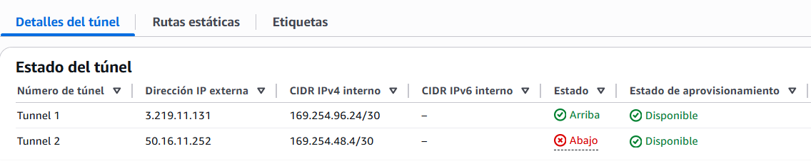

# Deploy Evidence

!!! info ""
    

    <h2 style="color: #3498DB; font-size: 1.8em; margin: 0.5em 0; font-weight: 600;">
    AWS DEPLOY
    </h2>
    

=== "GITEA HOME"
   
        
     

=== "USER PROFILE"

     

=== "ENABLED REPOSITORY"    

     

!!! info ""
    

    <h2 style="color: #3498DB; font-size: 1.8em; margin: 0.5em 0; font-weight: 600;">
    AZURE DEPLOY
    </h2>
    
    

=== "GITEA HOME"
   
     
     
     

=== "ACCOUNT LOGIN VERIFICATION"

     

=== "CREATE ORGANIZATION AND REPOSITORY"    

     

     

=== "ENABLED REPOSITORY"    

     

!!! info ""
    

    <h2 style="color: #3498DB; font-size: 1.8em; margin: 0.5em 0; font-weight: 600;">
    BLOCK: 
    </h2>
    
        

=== "FREE TIER ERROR"    

     

!!! info ""
    

    <h2 style="color: #3498DB; font-size: 1.8em; margin: 0.5em 0; font-weight: 600;">
    PROGRESS AFTER BLOCKS
    </h2>
    
      

 === "BINLOG "    

         

=== "MASTER STATUS EVIDENCE FROM AWS"    

             

=== "MESSAGES TEST AWS TO AZURE"    

            

=== "Pipeline #48 confirmed Replica"    

           
           

=== "VPN TUNNEL DETAILS"    

           
        

- **Sync Point Identification:** The SHOW MASTER STATUS command provides the exact File and Position coordinates. This metadata is essential for the replica to know exactly where to begin data ingestion without gaps or overlaps.

- **Security & Permissions:** A dedicated user (repl_azure) is configured with the REPLICATION SLAVE privilege. Following the principle of least privilege, we avoid using the 'root' account for external cloud connections.

- **Binary Log Tracking:** The transition from file ...000060 to ...000061 confirms that the database is actively recording traceable events. These logs are the "source of truth" that will be streamed to the Azure replica.

- **Data Consistency:** Using FLUSH PRIVILEGES forces the server to reload grant tables into memory immediately. This prevents connection failures during the initial handshake between the on-premise master and the Azure environment.