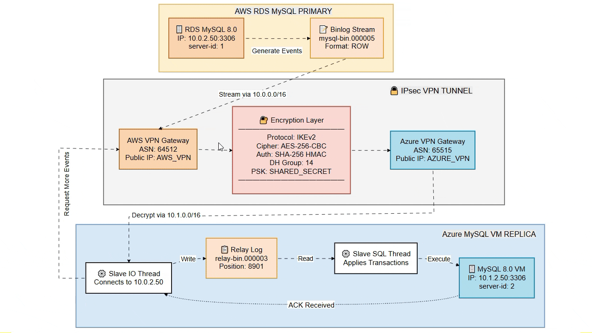

# Disaster Recovery 


---


!!! abstract " "
    Automated Fault Detection of the PRIMARY environment (AWS) to initiate a manual failover to the DR site (Azure).


!!! info ""
    <div align="center">
    <h2 style="color: #3498DB; font-size: 1.8em; margin: 0.5em 0; font-weight: 600;">
    🔧 Replication Infrastructure 
    </h2>
    </div>

=== "VPN Tunnel Topology with Binlog Streaming"
       
    

=== "Network Connectivity"
    **VPN Site-to-Site IPsec**
    
    ```hcl
    # Cross-cloud VPN connection
      resource "aws_vpn_connection" "azure" {
      count               = var.enable_vpn_gateway ? 1 : 0
      vpn_gateway_id      = aws_vpn_gateway.main[0].id
      customer_gateway_id = aws_customer_gateway.azure[0].id
      type                = "ipsec.1"
      static_routes_only  = true

        # Tunnel 1 configuration
        tunnel1_preshared_key = var.vpn_shared_key

        tags = {
          Name    = "infraGitea-vpn-connection-azure"
          Project = "infraGitea"
        }
      }

    
      resource "azurerm_virtual_network_gateway_connection" "aws" {
        count               = var.deployment_mode == "replica-only" && var.aws_vpn_gateway_ip != "" ? 1 : 0
        name                = "vpnconn-to-aws-${var.environment}"
        location            = var.location
        resource_group_name = azurerm_resource_group.main.name

        type                       = "IPsec"
        virtual_network_gateway_id = azurerm_virtual_network_gateway.main[0].id
        local_network_gateway_id   = azurerm_local_network_gateway.aws[0].id

        shared_key = var.vpn_shared_key

        tags = merge(var.tags, {
          environment = var.environment
        })
      }
    ```
    
    - Secure Cross-Cloud Interconnection: The bidirectional IPsec VPN tunnel provides the encrypted and private connection necessary for the MySQL IO Thread to communicate with the MySQL Master's Binlog.
    - IaC (Infrastructure as Code): Guarantees repeatability, auditability, and idempotency.
    - Security Coherence: The use of the same variable (var.vpn_shared_key) in both the AWS and Azure blocks is proof that the authentication key is synchronized and ensures that the IKE/IPsec connection can be established.


=== "Database Replication"
    **MySQL 8.0 Master-Replica Setup**
    
    ```sql
    -- AWS RDS (Master)
    [mysqld]
    server_id = 1
    log_bin = mysql-bin
    binlog_format = ROW
    
    -- Azure MySQL (Replica)
    [mysqld]
    server_id = 2
    relay_log = relay-bin
    read_only = 1
    ```
    
    **Key Features:**
    
    - **ROW Format**: Precise row-level replication
    - **Real-time**: < 1 second replication lag
    - **Data Safety**: Exact data replication for failover
    


    
!!! info ""
    <div align="center">
    <h2 style="color: #3498DB; font-size: 1.8em; margin: 0.5em 0; font-weight: 600;">
    🔧 Fail Detection and Alert Activation
    </h2>
    </div>


=== "MONITORING ARQUITECTURE"
    
    
    
    

!!! info ""
    <div align="center">
    <h2 style="color: #3498DB; font-size: 1.8em; margin: 0.5em 0; font-weight: 600;">
    ⚡ Executing the Recovery
    </h2>
    </div>


=== "Jenkins Pipeline Failover"

    


---

*Last Updated: {{ git_revision_date_localized }}*