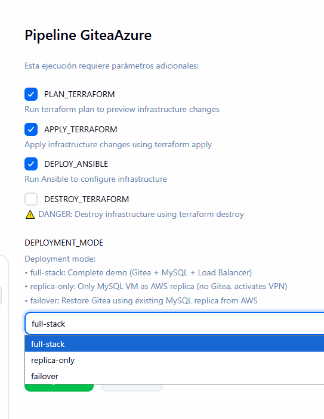

# Normal Operations Flow


---

!!! tip ""
    <div align="center">
    <h1 style="color: #27AE60; font-size: 2.5em; margin: 0.5em 0; font-weight: 700;">
    ⚙️ NORMAL OPERATIONS FLOW
    </h1>
    </div>

## AWS Active + Azure Standby

During normal operations, the architecture runs in **hybrid cost-optimized** mode:

   

---

!!! info ""
    <div align="center">
    <h2 style="color: #3498DB; font-size: 1.8em; margin: 0.5em 0; font-weight: 600;">
    🔧 OPERATIONAL FLOW DETAILS
    </h2>
    </div>

=== "Request Flow"
    **User Access**
    
    - **Endpoint**: AWS Application Load Balancer
    - **Actions**: Git operations, web UI, API calls
    - **Protocols**: HTTP/HTTPS, Git over HTTP

=== "Load Balancing"
    **Application Load Balancer (ALB)**
    
    - **Target**: EC2 instances on port 3000
    - **Health Check**: Every 30 seconds
    - **SSL**: HTTPS termination supported

=== "Application Layer"
    **Gitea on EC2**
    
    - **Service**: Gitea v1.21.5 via systemd
    - **Operations**: Read/write to RDS MySQL
    - **Performance**: < 200ms response time

=== "Database Replication"
    **MySQL Master-Replica**
    
    - **Primary**: AWS RDS MySQL
    - **Replica**: Azure MySQL Flexible Server
    - **Connection**: Encrypted VPN tunnel
    - **Lag**: < 1 second
    - **Status**: Ready for failover

!!! example ""
    <div align="center">
    <h2 style="color: #9B59B6; font-size: 1.8em; margin: 0.5em 0; font-weight: 600;">
    🚀 DEPLOYMENT PIPELINE
    </h2>
    </div>

=== "AWS Pipeline"
    **Automated Deployment**
    
    ```mermaid
    flowchart LR
        Trigger["🚀 Jenkins Build"] --> Stage1["📋 Terraform"]
        Stage1 --> Stage2["📋 Inventory"]
        Stage2 --> Stage3["📋 Ansible"]
        Stage3 --> Success["✅ Success"]
        
        classDef stage fill:#3498db,stroke:#2980b9,stroke-width:2px,color:#fff
        classDef success fill:#27ae60,stroke:#229954,stroke-width:2px,color:#fff
        
        class Trigger,Stage1,Stage2,Stage3 stage
        class Success success
    ```
    
    **Pipeline Steps:**
    
    1. **Terraform** - Provision AWS infrastructure
    2. **Inventory** - Generate Ansible inventory
    3. **Ansible** - Deploy and configure Gitea
    4. **Success** - Service available via ALB

=== "Azure Pipeline"
    **Manual Deployment (DR Only)**
    
    ```mermaid
    flowchart LR
        Trigger["🚀 Manual Trigger"] --> Mode["🔄 Select Mode"]
        Mode --> Deploy["📋 Deploy"]
        Deploy --> Success["✅ Success"]
        
        classDef stage fill:#0078d4,stroke:#ffffff,stroke-width:2px,color:#fff
        classDef success fill:#27ae60,stroke:#229954,stroke-width:2px,color:#fff
        
        class Trigger,Mode,Deploy stage
        class Success success
    ```
    
    **Deployment Modes:**
    
    | Mode | Components | Use Case |
    |------|------------|----------|
    | **REPLICA-ONLY** | MySQL only | Normal standby |
    | **FAILOVER** | VM + MySQL + LB | Disaster recovery |

=== "Azure 3 Modes Pipeline"
    **Manual Deployment (DR Only)**
    
     
    
    **Deployment Modes:**
    
    | Mode | Components | Use Case |
    |------|------------|----------|
    | **FULLSTACK** | All Infra | Normal standby |
    | **REPLICA-ONLY** | MySQL only | Normal standby |
    | **FAILOVER** | VM + MySQL + LB | Disaster recovery |


!!! success ""
    <div align="center">
    <h2 style="color: #27AE60; font-size: 1.8em; margin: 0.5em 0; font-weight: 600;">
    📊 OPERATIONAL METRICS
    </h2>
    </div>

| Metric | AWS Primary | Azure Standby | Status |
|--------|-------------|---------------|--------|
| **Uptime** | 99.9% | N/A (Standby) | ✅ **Operational** |
| **Response Time** | < 200ms | N/A | ✅ **Optimal** |
| **Replication Lag** | N/A | < 1 second | ✅ **Real-time** |
| **Data Integrity** | 100% | 100% | ✅ **Guaranteed** |

---

*Last Updated: {{ git_revision_date_localized }}*