# Gitea Multi-Cloud Disaster Recovery Infrastructure


---

## 📋 Proyecto Multi-Cloud Gitea

!!! abstract "Resumen Ejecutivo"
    **Sistema Gitea** (Git self-hosted) desplegado en **AWS + Azure** con arquitectura de alta disponibilidad, disaster recovery automático y replicación de datos para garantizar **continuidad del servicio 24/7**

### ⚡ **Beneficios Principales**

=== "Solution Overview"
    **Enterprise Git Platform with Multi-Cloud Resilience**
    
    ```
    ╔═══════════════════════════════════════════════════════════════════════════════════════════════════════════════════╗
    ║                                🏛️ ENTERPRISE GIT INFRASTRUCTURE ARCHITECTURE                                ║
    ╚═══════════════════════════════════════════════════════════════════════════════════════════════════════════════════╝
    
    👨‍💼 Enterprise Users ──► 🚀 CI/CD Pipeline ──► 📋 Infrastructure as Code
                                                            │
                                                            ▼
    ╔═══════════════════════════════════════════════════════╗    🔒 Encrypted Tunnel    ╔═══════════════════════════════════════════════════════╗
    ║          ☁️ AWS PRODUCTION REGION            ║◄═══════ Secure Replication ═══════►║          ☁️ AZURE DR REGION                  ║
    ║                                               ║                                    ║                                               ║
    ║  🏢 Gitea Enterprise Platform                ║                                    ║  🛡️ Gitea Disaster Recovery Site           ║
    ║      ║                                        ║                                    ║      ║                                        ║
    ║      ▼                                        ║                                    ║      ▼                                        ║
    ║  🗄️ MySQL Master Cluster (RDS Multi-AZ)     ║                                    ║  🗄️ MySQL Standby Replica (Flexible)       ║
    ║      ║                                        ║                                    ║      ║                                        ║
    ║      ▼                                        ║                                    ║      ▼                                        ║
    ║  📊 Real-time Operations & Monitoring         ║                                    ║  📈 Passive Health Monitoring                ║
    ║  🔄 Auto-scaling & Load Balancing            ║                                    ║  ⚡ Failover Automation Ready                ║
    ╚═══════════════════════════════════════════════════════╝                                    ╚═══════════════════════════════════════════════════════╝
    
    🎯 SLA Compliance: 99.9% Uptime Target    🛡️ Data Integrity: RPO < 15 seconds    ⚡ Business Continuity: RTO < 3 minutes
    ```
    
    **Enterprise Value:** Production-ready multi-cloud infrastructure with enterprise-grade disaster recovery and automated failover capabilities.

=== "Technology Stack"
    | **Layer** | **Technology** | **Business Purpose** |
    |-----------|----------------|----------------------|
    | **Infrastructure** | Terraform Enterprise | Standardized, auditable infrastructure provisioning |
    | **Configuration** | Ansible Automation | Consistent, repeatable application deployment |
    | **CI/CD Pipeline** | Jenkins Enterprise | Automated software delivery with governance |
    | **Data Platform** | MySQL Enterprise | High-performance database with enterprise support |
    | **Network Security** | IPsec VPN | Encrypted cross-cloud connectivity with compliance |
    
    **Compliance:** SOC 2, ISO 27001 compatible architecture

=== "Technical Architecture Benefits"
    **Multi-Cloud Infrastructure Implementation**
    
    - **High Availability:** MySQL master-replica replication with IPsec VPN tunnel and automated DNS failover mechanisms
    - **Infrastructure Automation:** Terraform state management with Ansible configuration drift detection and GitOps workflows
    - **Cross-Cloud Resilience:** AWS EC2/RDS primary cluster with Azure VM/MySQL Flexible Server standby using binlog replication

=== "Performance Metrics"
    **Demo Environment Outcomes**
    
    | **Metric** | **Target** | **Business Impact** |
    |------------|------------|---------------------|
    | **RTO** | 5 minutes | Quick demo recovery |
    | **RPO** | < 30 seconds | Minimal data loss |
    | **Availability** | 99.5% | Reliable demo platform |
    | **Deployment Speed** | 3 minutes | Automated demo setup |
    
    **Demo Value:** Proof of concept for enterprise scalability

### Flujo de Arquitectura Multi-Cloud

```mermaid
flowchart TD
    %% DevOps Practices
    A["🏗️ DevOps Modernas"] --> B["📋 Infrastructure as Code"]
    A --> C["🔄 CI/CD Automatizado"]
    A --> D["⚡ Disaster Recovery"]
    
    %% Infrastructure as Code
    B --> E["☁️ Terraform AWS"]
    B --> F["☁️ Terraform Azure"]
    
    %% CI/CD
    C --> G["🤖 Jenkins AWS"]
    C --> H["🤖 Jenkins Azure"]
    
    %% Configuration Management
    E --> I["⚙️ Ansible AWS"]
    F --> J["⚙️ Ansible Azure"]
    
    %% Applications
    I --> K["📦 Gitea Primary (AWS)"]
    J --> L["📦 Gitea Standby (Azure)"]
    
    %% Database Layer
    K --> M["🗄️ MySQL Master (RDS)"]
    L --> N["🗄️ MySQL Replica (Azure)"]
    
    %% Replication
    M -->|"📡 Binlog Repl\n< 1 sec lag"| N
    
    %% Network
    O["🔐 VPN IPsec Tunnel"] --> M
    O --> N
    
    %% Disaster Recovery
    D --> P["🚨 Failover Manual"]
    P --> Q["📱 Notificación Auto"]
    
    %% Objectives
    Q --> R["⏱️ RTO: ~20 min"]
    Q --> S["💾 RPO: < 1 sec"]
    
    %% Styling
    classDef aws fill:#ff9900,stroke:#232f3e,stroke-width:2px,color:#fff
    classDef azure fill:#0078d4,stroke:#ffffff,stroke-width:2px,color:#fff
    classDef devops fill:#2ecc71,stroke:#27ae60,stroke-width:2px,color:#fff
    classDef network fill:#9b59b6,stroke:#8e44ad,stroke-width:2px,color:#fff
    classDef metrics fill:#e74c3c,stroke:#c0392b,stroke-width:2px,color:#fff
    
    class E,G,I,K,M aws
    class F,H,J,L,N azure
    class A,B,C,D devops
    class O network
    class P,Q,R,S metrics
```




---

## Arquitectura de la Solución Multi-Cloud

La solución se compone de **4 repositorios Git independientes** que trabajan de forma coordinada:

| Repositorio               | Cloud | Tipo           | Propósito                                |
| ------------------------- | ----- | -------------- | ---------------------------------------- |
| **tf-infra-demoGitea**    | AWS   | Terraform IaC  | Provisiona infraestructura AWS (Primary) |
| **ansible-demoGitea**     | AWS   | Ansible Config | Despliega/configura Gitea en AWS EC2     |
| **tf-az-infra-demoGitea** | Azure | Terraform IaC  | Provisiona infraestructura Azure (DR)    |
| **ansible-az-demoGitea**  | Azure | Ansible Config | Despliega/configura Gitea en Azure VM    |


---

*Last Updated: {{ git_revision_date_localized }}*