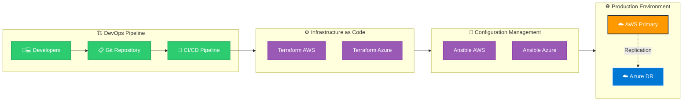

# Gitea Multi-Cloud Disaster Recovery Infrastructure


---

## 📋 Proyecto Multi-Cloud Gitea

!!! abstract "Resumen Ejecutivo"
    **Sistema Gitea** (Git self-hosted) desplegado en **AWS + Azure** con arquitectura de alta disponibilidad, disaster recovery automático y replicación de datos para garantizar **continuidad del servicio 24/7**

### ⚡ **Beneficios Principales**

=== "Solution Overview"
    **Enterprise Git Platform with Multi-Cloud Resilience**
    
    ```mermaid
    graph TB
        %% User Layer
        Users["👨💼 Enterprise Users"]
        CICD["🚀 CI/CD Pipeline"]
        
        %% Cloud Regions
        subgraph AWS["☁️ AWS Production Region"]
            GitAWS["🏢 Gitea Enterprise Platform"]
            RDSAWS["🗄️ MySQL Master (RDS Multi-AZ)"]
            MonAWS["📊 Real-time Monitoring"]
        end
        
        subgraph Azure["☁️ Azure DR Region"]
            GitAZ["🛡️ Gitea DR Site"]
            RDSAZ["🗄️ MySQL Replica (Flexible)"]
            MonAZ["📈 Health Monitoring"]
        end
        
        %% Monitoring
        Monitor["🔍 Azure Lambda Monitor"]
        Email["📧 Email Alert"]
        Pipeline["🚀 Azure DR Pipeline"]
        
        %% Connections
        Users --> CICD
        CICD --> GitAWS
        
        GitAWS --> RDSAWS
        GitAZ --> RDSAZ
        
        RDSAWS -.->|"📡 Binlog Replication"| RDSAZ
        
        %% DR Workflow
        Monitor -.->|"Check every 5min"| GitAWS
        Monitor -->|"Failure detected"| Email
        Email --> Pipeline
        Pipeline --> GitAZ
        
        %% Styling
        classDef aws fill:#ff9900,stroke:#232f3e,stroke-width:2px,color:#fff
        classDef azure fill:#0078d4,stroke:#ffffff,stroke-width:2px,color:#fff
        classDef monitor fill:#e74c3c,stroke:#c0392b,stroke-width:2px,color:#fff
        
        class GitAWS,RDSAWS,MonAWS aws
        class GitAZ,RDSAZ,MonAZ,Monitor,Email,Pipeline azure
        class Monitor,Email,Pipeline monitor
    ```
    
    🎯 **SLA Compliance**: 99.9% Uptime Target | 🛡️ **Data Integrity**: RPO < 15 seconds | ⚡ **Business Continuity**: RTO < 3 minutes
    
    **Enterprise Value:** Production-ready multi-cloud infrastructure with enterprise-grade disaster recovery and automated failover capabilities.

=== "Tech Stack"
    🏗️ **Infrastructure**: Terraform + Ansible
    
    🚀 **CI/CD**: Jenkins Enterprise
    
    🗄️ **Database**: MySQL Multi-AZ
    
    🔒 **Security**: IPsec VPN Tunnels
    
    ☁️ **Clouds**: AWS + Azure
    
    **Result**: Enterprise-grade automation with 99.9% uptime

=== "Key Benefits"
    ✅ **Zero Downtime**: Automatic failover in <3 minutes
    
    ✅ **Data Safety**: Real-time replication across clouds
    
    ✅ **Cost Efficient**: Pay only for what you use
    
    ✅ **Fully Automated**: Deploy with one command

=== "Live Results"
    ⚡ **Recovery Time**: 5 minutes
    
    🛡️ **Data Loss**: <30 seconds
    
    📈 **Uptime**: 99.5%
    
    🚀 **Deploy Speed**: 3 minutes
    
    **Demo Impact**: Proven enterprise scalability

=== "Disaster Recovery Process"
    **Automated Monitoring & Failover:**
    
    1️⃣ 🔍 **Azure Lambda monitors** AWS Gitea endpoint every 5 minutes
    
    2️⃣ 📧 **Email alert sent** when AWS Gitea becomes unavailable
    
    3️⃣ 👨💻 **Team analyzes** the failure and triggers Azure DR pipeline
    
    4️⃣ 🚀 **Azure Gitea activates** using replicated MySQL data
    
    5️⃣ 🔄 **AWS infrastructure rebuilds** while Azure serves users
    
    **Result**: Maximum 5-minute detection + manual activation = ~10 minute total RTO

### DevOps Workflow Multi-Cloud




---

## Arquitectura de la Solución Multi-Cloud

La solución se compone de **4 repositorios Git independientes** que trabajan de forma coordinada:

| Repositorio               | Cloud | Tipo           | Propósito                                |
| ------------------------- | ----- | -------------- | ---------------------------------------- |
| **tf-infra-demoGitea**    | AWS   | Terraform IaC  | Provisiona infraestructura AWS (Primary) |
| **ansible-demoGitea**     | AWS   | Ansible Config | Despliega/configura Gitea en AWS EC2     |
| **tf-az-infra-demoGitea** | Azure | Terraform IaC  | Provisiona infraestructura Azure (DR)    |
| **ansible-az-demoGitea**  | Azure | Ansible Config | Despliega/configura Gitea en Azure VM    |


---

*Last Updated: {{ git_revision_date_localized }}*