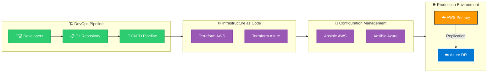

# GITeaEnhance - Multi-Cloud Platform


---

!!! abstract ""
    <div align="center">
    <h1 style="color: #2E86AB; font-size: 2.5em; margin: 0.5em 0; text-shadow: 2px 2px 4px rgba(0,0,0,0.1);">
    🚀 GITEAENHANCE - MULTI-CLOUD PLATFORM
    </h1>
    </div>

!!! abstract "Executive Summary"
    **Gitea System** (Git self-hosted) deployed on **AWS + Azure** with high availability architecture, automatic disaster recovery and data replication to ensure **24/7 service continuity**

### ⚡ **Key Benefits**

=== "Solution Overview"
    **Enterprise Git Platform with Multi-Cloud Resilience**
    
    ```mermaid
    graph TB
        %% User Layer
        Users["👨💼 Enterprise Users"]
        CICD["🚀 CI/CD Pipeline"]
        
        %% Cloud Regions
        subgraph AWS["☁️ AWS Production Region"]
            GitAWS["🏢 Gitea Enterprise Platform"]
            RDSAWS["🗄️ MySQL Master (RDS Multi-AZ)"]
            MonAWS["📊 Real-time Monitoring"]
        end
        
        subgraph Azure["☁️ Azure DR Region"]
            GitAZ["🛡️ Gitea DR Site"]
            RDSAZ["🗄️ MySQL Replica (Flexible)"]
            MonAZ["📈 Health Monitoring"]
        end
        
        %% Monitoring
        Monitor["🔍 Azure Lambda Monitor"]
        Email["📧 Email Alert"]
        Pipeline["🚀 Azure DR Pipeline"]
        
        %% Connections
        Users --> CICD
        CICD --> GitAWS
        
        GitAWS --> RDSAWS
        GitAZ --> RDSAZ
        
        RDSAWS -.->|"📡 Binlog Replication"| RDSAZ
        
        %% DR Workflow
        Monitor -.->|"Check every 5min"| GitAWS
        Monitor -->|"Failure detected"| Email
        Email --> Pipeline
        Pipeline --> GitAZ
        
        %% Styling
        classDef aws fill:#ff9900,stroke:#232f3e,stroke-width:2px,color:#fff
        classDef azure fill:#0078d4,stroke:#ffffff,stroke-width:2px,color:#fff
        classDef monitor fill:#e74c3c,stroke:#c0392b,stroke-width:2px,color:#fff
        
        class GitAWS,RDSAWS,MonAWS aws
        class GitAZ,RDSAZ,MonAZ,Monitor,Email,Pipeline azure
        class Monitor,Email,Pipeline monitor
    ```
    
    🎯 **SLA Compliance**: 99.9% Uptime Target | 🛡️ **Data Integrity**: RPO < 15 seconds | ⚡ **Business Continuity**: RTO < 3 minutes
    
    **Enterprise Value:** Production-ready multi-cloud infrastructure with enterprise-grade disaster recovery and automated failover capabilities.

=== "Tech Stack"
    **Multi-Cloud Infrastructure Components**
    
    | **Component** | **Technology** | **Purpose** | **Cloud** |
    |---------------|----------------|-------------|----------|
    | 🏗️ **Infrastructure** | Terraform | Infrastructure as Code provisioning | AWS + Azure |
    | ⚙️ **Configuration** | Ansible | Automated application deployment | AWS + Azure |
    | 🚀 **CI/CD** | Jenkins | Independent build servers per cloud | AWS + Azure |
    | 🗄️ **Database** | MySQL | Master-Replica with binlog replication | AWS → Azure |
    | 🔒 **Network** | IPsec VPN | Site-to-Site encrypted tunnel | Cross-Cloud |
    | 🖥️ **Compute** | EC2 + Azure VM | t3.small + Standard_DC1ds_v3 | Multi-Cloud |
    
    **Architecture**: 4 independent Git repositories working in coordination

=== "Key Benefits"
    **Enterprise-Grade Multi-Cloud Capabilities**
    
    | **Benefit** | **Implementation** | **Business Value** |
    |-------------|-------------------|-------------------|
    | 🛡️ **High Availability** | MySQL Master-Replica replication | < 1 second data lag |
    | 🔄 **Disaster Recovery** | Cross-cloud failover capability | ~20 minute RTO target |
    | 🏗️ **Infrastructure as Code** | Terraform + Ansible automation | Repeatable, auditable deployments |
    | 🔒 **Secure Connectivity** | IPsec VPN Site-to-Site tunnel | Encrypted cross-cloud communication |
    | 📦 **Independent Deployment** | 4 coordinated Git repositories | Modular, maintainable architecture |
    | ⚡ **Modern DevOps** | CI/CD with Jenkins per cloud | Automated build and deployment |
    
    **Demo Value**: Production-ready architecture patterns

=== "Disaster Recovery Process"
    **Manual Failover Flow**
    
    ```mermaid
    flowchart LR
        A["1️⃣ 🔍 Failure Detection<br/>Real-time<br/>(Automated)"] --> B["2️⃣ 📧 Alert Notification<br/>Immediate<br/>(Automated)"]
        B --> C["3️⃣ 👨💻 Team Analysis<br/>5-10 min<br/>(Manual)"]
        C --> D["4️⃣ 🚀 DR Activation<br/>5-10 min<br/>(Manual)"]
        D --> E["5️⃣ ⚡ Service Restored<br/>< 5 min<br/>(Automated)"]
        
        classDef automated fill:#e8f5e8,stroke:#4caf50,stroke-width:2px
        classDef manual fill:#fff3e0,stroke:#ff9800,stroke-width:2px
        
        class A,B,E automated
        class C,D manual
    ```
    
    **Results**: RTO ~20 minutes | RPO < 1 second | MySQL binlog replication

!!! tip ""
    <div align="center">
    <h2 style="color: #27AE60; font-size: 2em; margin: 0.5em 0; font-weight: 600; letter-spacing: 1px;">
    🔄 DEVOPS WORKFLOW MULTI-CLOUD
    </h2>
    </div>

**Enterprise DevOps Pipeline:**

- Production-grade multi-cloud CI/CD with 4 coordinated Git repositories
- Terraform provisions AWS (EC2, RDS) and Azure (VM, MySQL) infrastructure
- Ansible deploys Gitea v1.21.5 with IPsec VPN replication (< 1s lag)
- Independent Jenkins servers per cloud for credential isolation




---

!!! example ""
    <div align="center">
    <h2 style="color: #8E44AD; font-size: 2em; margin: 0.5em 0; font-weight: 600; letter-spacing: 1px;">
    🏗️ KEY ARCHITECTURE DECISIONS
    </h2>
    </div>

=== "Two Independent Jenkins Servers"
    - **Context:** Each cloud provider requires specific credentials, configurations and access policies
    - **Decision:** Deploy a dedicated Jenkins server in each cloud (Jenkins AWS + Jenkins Azure) instead of a single centralized Jenkins
    - **Credential isolation**: Each Jenkins only has access to its cloud
    - **Operational autonomy**: Azure can operate independently if AWS fails
    - **Security**: Reduced attack surface (no cross-cloud credentials in one place)

    ```mermaid
    graph TB
        subgraph "Multi-Cloud Jenkins Architecture"
            subgraph AWS["☁️ AWS Cloud"]
                JenkinsAWS["🤖 Jenkins AWS<br/>- AWS Credentials<br/>- EC2 Access<br/>- RDS Management"]
                InfraAWS["🏗️ AWS Infrastructure<br/>- VPC, EC2, RDS<br/>- Security Groups"]
            end
            
            subgraph Azure["☁️ Azure Cloud"]
                JenkinsAZ["🤖 Jenkins Azure<br/>- Azure Credentials<br/>- VM Access<br/>- MySQL Management"]
                InfraAZ["🏗️ Azure Infrastructure<br/>- VNet, VM, MySQL<br/>- NSG Rules"]
            end
            
            Dev["👨💻 DevOps Team"]
            
            Dev --> JenkinsAWS
            Dev --> JenkinsAZ
            JenkinsAWS --> InfraAWS
            JenkinsAZ --> InfraAZ
            
            InfraAWS -.->|"🔒 VPN Tunnel"| InfraAZ
        end
        
        classDef aws fill:#ff9900,stroke:#232f3e,stroke-width:2px,color:#fff
        classDef azure fill:#0078d4,stroke:#ffffff,stroke-width:2px,color:#fff
        classDef dev fill:#2ecc71,stroke:#27ae60,stroke-width:2px,color:#fff
        
        class JenkinsAWS,InfraAWS aws
        class JenkinsAZ,InfraAZ azure
        class Dev dev
    ```

=== "Unidirectional MySQL Replication (AWS → Azure)"
    - **Context:** Define data flow between clouds
    - **Decision:** Unidirectional master-slave replication from AWS (Master) to Azure (Replica)
    - **Simplicity**: Avoids bidirectional synchronization conflicts
    - **Clear role**: AWS is PRIMARY, Azure is DR
    - **Split-brain prevention**: No simultaneous writes in both clouds

    **Replication flow:**

    ```mermaid
    graph LR
        UserOp["👤 User Operation<br/>INSERT/UPDATE/DELETE"] --> RDSMaster["🗄️ RDS MySQL (Master)<br/>AWS Cloud"]
        RDSMaster --> Transmission["📝 Data Transmission<br/>Through VPN"]
        Transmission --> MySQLReplica["🗄️ MySQL Replica<br/>Azure Cloud"]
        MySQLReplica --> ProcessThread["🔄 Process & Apply<br/>Events"]
        ProcessThread --> Active["✅ REPLICATION ACTIVE<br/>Lag: < 1 second"]
        
        classDef aws fill:#ff9900,stroke:#232f3e,stroke-width:2px,color:#fff
        classDef azure fill:#0078d4,stroke:#ffffff,stroke-width:2px,color:#fff
        classDef process fill:#9b59b6,stroke:#8e44ad,stroke-width:2px,color:#fff
        classDef success fill:#27ae60,stroke:#229954,stroke-width:2px,color:#fff
        
        class RDSMaster aws
        class MySQLReplica azure
        class UserOp,Binlog,Transmission,IOThread,SQLThread process
        class Active success
    ```

=== "SSH Jump Host (Bastion) Architecture"
    - **Context:** MySQL database security requirements in Azure cloud
    - **Decision:** Deploy MySQL VM without public IP, accessible only via SSH ProxyJump through Gitea VM
    - **Security**: MySQL not exposed to Internet
    - **Cost optimization**: No additional public IP consumption
    - **Compliance**: Enhanced security posture for audits
    - **Trade-off**: Ansible requires ProxyCommand configuration

    **Access Architecture:**

    ```mermaid
    graph TB
        subgraph Internet["🌐 Internet"]
            Dev["👨💻 Developer/Jenkins<br/>External Access"]
        end
        
        subgraph Azure["☁️ Azure VNet (10.1.0.0/16)"]
            subgraph Public["🌍 Public Subnet"]
                Gitea["🚀 Gitea VM (Jump Host)<br/>Public IP: 40.71.214.30<br/>Private IP: 10.1.0.5<br/>Port 22: SSH ✓<br/>Port 3000: HTTP ✓"]
            end
            
            subgraph Private["🔒 Private Subnet"]
                MySQL["🗄️ MySQL VM<br/>Public IP: NONE<br/>Private IP: 10.1.1.4<br/>Port 22: SSH ✓<br/>Port 3306: MySQL ✓"]
            end
        end
        
        %% Connections
        Dev -->|"Direct SSH<br/>ssh azureuser@40.71.214.30"| Gitea
        Dev -.->|"ProxyJump SSH<br/>ssh -J azureuser@40.71.214.30<br/>azureuser@10.1.1.4"| MySQL
        Gitea -->|"Internal Routing<br/>Private Network"| MySQL
        
        %% Styling
        classDef public fill:#e74c3c,stroke:#c0392b,stroke-width:2px,color:#fff
        classDef private fill:#27ae60,stroke:#229954,stroke-width:2px,color:#fff
        classDef external fill:#3498db,stroke:#2980b9,stroke-width:2px,color:#fff
        
        class Gitea public
        class MySQL private
        class Dev external
    ```
    
    **Security Benefits:**
    
    ✅ **Zero Internet Exposure**: MySQL VM completely isolated from public access  
    ✅ **Controlled Access Point**: Single entry point through hardened jump host  
    ✅ **Cost Efficient**: Saves additional public IP allocation costs  
    ✅ **Audit Compliance**: Meets enterprise security standards for database access

---

!!! quote ""
    <div align="center">
    <h2 style="color: #E67E22; font-size: 2em; margin: 0.5em 0; font-weight: 600; letter-spacing: 1px;">
    🌐 MULTI-CLOUD SOLUTION ARCHITECTURE
    </h2>
    </div>

The solution consists of **4 independent Git repositories** working in coordination:

| Repository                | Cloud | Type           | Purpose                                  |
| ------------------------- | ----- | -------------- | ---------------------------------------- |
| **tf-infra-demoGitea**    | AWS   | Terraform IaC  | Provisions AWS infrastructure (Primary)  |
| **ansible-demoGitea**     | AWS   | Ansible Config | Deploys/configures Gitea on AWS EC2     |
| **tf-az-infra-demoGitea** | Azure | Terraform IaC  | Provisions Azure infrastructure (DR)     |
| **ansible-az-demoGitea**  | Azure | Ansible Config | Deploys/configures Gitea on Azure VM    |

---

*Last Updated: {{ git_revision_date_localized }}*