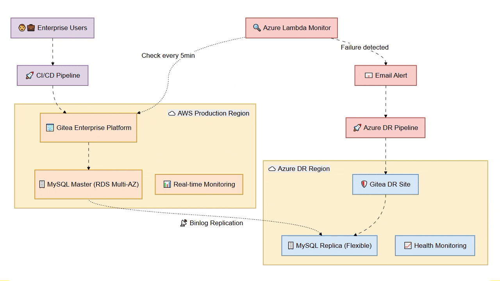
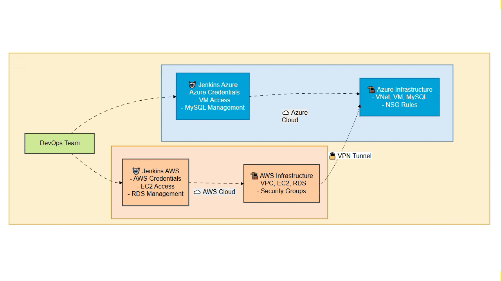
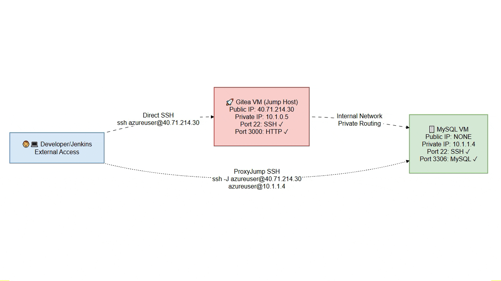

# GITeaEnhance - Multi-Cloud Platform


---

!!! abstract ""
    <div align="center">
    <h1 style="color: #2E86AB; font-size: 2.5em; margin: 0.5em 0; text-shadow: 2px 2px 4px rgba(0,0,0,0.1);">
    🚀 GITEAENHANCE - MULTI-CLOUD PLATFORM
    </h1>
    </div>

!!! abstract "Executive Summary"
    **Gitea System** (Git self-hosted) deployed on **AWS + Azure** with high availability architecture, automatic disaster recovery and data replication to ensure **24/7 service continuity**

### ⚡ **Key Benefits**

=== "Solution Overview"
    **Enterprise Git Platform with Multi-Cloud Resilience**

    🎯 **SLA Compliance**: 99.9% Uptime Target | 🛡️ **Data Integrity**: RPO < 15 seconds | ⚡ **Business Continuity**: RTO < 20 minutes
    
    **Enterprise Value:** Production-ready multi-cloud infrastructure with enterprise-grade disaster recovery and automated failover capabilities.

     


=== "Tech Stack"
    **Multi-Cloud Infrastructure Components**
    
    | **Component** | **Technology** | **Purpose** | **Cloud** |
    |---------------|----------------|-------------|----------|
    | 🏗️ **Infrastructure** | Terraform | Infrastructure as Code provisioning | AWS + Azure |
    | ⚙️ **Configuration** | Ansible | Automated application deployment | AWS + Azure |
    | 🚀 **CI/CD** | Jenkins | Independent build servers per cloud | AWS + Azure |
    | 🗄️ **Database** | MySQL | Master-Replica with binlog replication | AWS → Azure |
    | 🔒 **Network** | IPsec VPN | Site-to-Site encrypted tunnel | Cross-Cloud |
    | 🖥️ **Compute** | EC2 + Azure VM | t3.small + Standard_DC1ds_v3 | Multi-Cloud |
    


=== "Key Benefits"
    **Enterprise-Grade Multi-Cloud Capabilities**
    
    | **Benefit** | **Implementation** | **Business Value** |
    |-------------|-------------------|-------------------|
    | 🛡️ **High Availability** | MySQL Master-Replica replication | < 1 second data lag |
    | 🔄 **Disaster Recovery** | Cross-cloud failover capability | ~20 minute RTO target |
    | 🏗️ **Infrastructure as Code** | Terraform + Ansible automation | Repeatable, auditable deployments |
    | 🔒 **Secure Connectivity** | IPsec VPN Site-to-Site tunnel | Encrypted cross-cloud communication |
    | 📦 **Independent Deployment** | 4 coordinated Git repositories | Modular, maintainable architecture |
    | ⚡ **Modern DevOps** | CI/CD with Jenkins per cloud | Automated build and deployment |
    
   
=== "Disaster Recovery Process"
    **Manual Failover Flow**
    
    ```mermaid
    flowchart LR
        A["1️⃣ 🔍 Failure Detection<br/>Real-time<br/>(Automated)"] --> B["2️⃣ 📧 Alert Notification<br/>Immediate<br/>(Automated)"]
        B --> C["3️⃣ 👨💻 Team Analysis<br/>5-10 min<br/>(Manual)"]
        C --> D["4️⃣ 🚀 DR Activation<br/>5-10 min<br/>(Manual)"]
        D --> E["5️⃣ ⚡ Service Restored<br/>< 5 min<br/>(Automated)"]
        
        classDef automated fill:#e8f5e8,stroke:#4caf50,stroke-width:2px
        classDef manual fill:#fff3e0,stroke:#ff9800,stroke-width:2px
        
        class A,B,E automated
        class C,D manual
    ```
    
    **Results**: RTO ~20 minutes | RPO < 15 second | MySQL binlog replication

!!! tip ""
    <div align="center">
    <h2 style="color: #27AE60; font-size: 2em; margin: 0.5em 0; font-weight: 600; letter-spacing: 1px;">
    🔄 DEVOPS WORKFLOW MULTI-CLOUD
    </h2>
    </div>

**DevOps Pipeline:**

- Production-grade multi-cloud CI/CD with 4 coordinated Git repositories
- Terraform provisions AWS (EC2, RDS) and Azure (VM, MySQL) infrastructure
- Ansible deploys Gitea v1.21.5 with IPsec VPN replication (< 1s lag)
- Independent Jenkins servers per cloud for credential isolation

    


---

!!! example ""
    <div align="center">
    <h2 style="color: #8E44AD; font-size: 2em; margin: 0.5em 0; font-weight: 600; letter-spacing: 1px;">
    🏗️ KEY ARCHITECTURE DECISIONS
    </h2>
    </div>

=== "Two Independent Jenkins Servers"
    - **Context:** Each cloud provider requires specific credentials, configurations and access policies
    - **Decision:** Deploy a dedicated Jenkins server in each cloud (Jenkins AWS + Jenkins Azure) instead of a single centralized Jenkins
    - **Credential isolation**: Each Jenkins only has access to its cloud
    - **Operational autonomy**: Azure can operate independently if AWS fails
    - **Security**: Reduced attack surface (no cross-cloud credentials in one place)

     


=== "Free Tier Limitations"
    **AWS:**
    **Issue:** Free Tier blocks `backup_retention_period >= 1` required for binlog
    

    **AZURE:**
    **Issue:** Free Tier 3 IP Limit  
    
    **Resolution:**


=== "SSH Jump Host (Bastion) Architecture"
    - **Context:** MySQL database security requirements in Azure cloud
    - **Decision:** Deploy MySQL VM without public IP, accessible only via SSH ProxyJump through Gitea VM
    - **Security**: MySQL not exposed to Internet
    - **Cost optimization**: No additional public IP consumption
    - **Compliance**: Enhanced security posture for audits
    - **Trade-off**: Ansible requires ProxyCommand configuration

    **Access Architecture:**

     
    
    **Security Benefits:**
    
    ✅ **Zero Internet Exposure**: MySQL VM completely isolated from public access  
    ✅ **Controlled Access Point**: Single entry point through hardened jump host  
    ✅ **Cost Efficient**: Saves additional public IP allocation costs  
    ✅ **Audit Compliance**: Meets enterprise security standards for database access

---

!!! quote ""
    <div align="center">
    <h2 style="color: #E67E22; font-size: 2em; margin: 0.5em 0; font-weight: 600; letter-spacing: 1px;">
    🌐 RESOURCES - RESUME
    </h2>
    </div>


| Repository                | Cloud | Type           | Purpose                                  |
| ------------------------- | ----- | -------------- | ---------------------------------------- |
| [tf-infra-demoGitea](https://github.com/andreaendigital/tf-infra-demoGitea)    | AWS   | Terraform IaC  | Provisions AWS infrastructure (Primary)  |
| [ansible-demoGitea](https://github.com/andreaendigital/ansible-demoGitea)     | AWS   | Ansible Config | Deploys/configures Gitea on AWS EC2     |
| [tf-az-infra-demoGitea](https://github.com/andreaendigital/tf-az-infra-demoGitea) | Azure | Terraform IaC  | Provisions Azure infrastructure (DR)     |
| [ansible-az-demoGitea](https://github.com/andreaendigital/ansible-az-demoGitea)  | Azure | Ansible Config | Deploys/configures Gitea on Azure VM    |


This project demonstrates a **fully functional multi-cloud disaster recovery architecture** with:

- ✅ **4 integrated Git repositories** with Terraform + Ansible
- ✅ **2 independent Jenkins servers** (AWS + Azure)
- ✅ **Cross-cloud MySQL replication** (AWS RDS → Azure MySQL)
- ✅ **Site-to-Site IPsec VPN** between clouds
- ✅ **RTO: ~20 minutes | RPO: < 1 second**
---

*Last Updated: {{ git_revision_date_localized }}*
