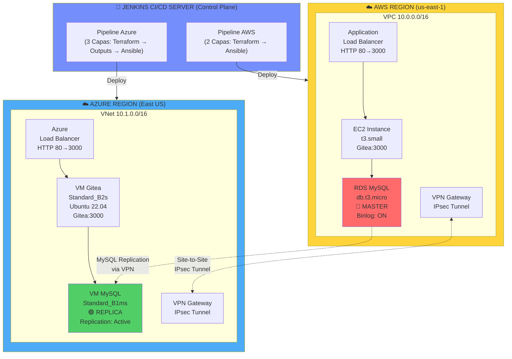
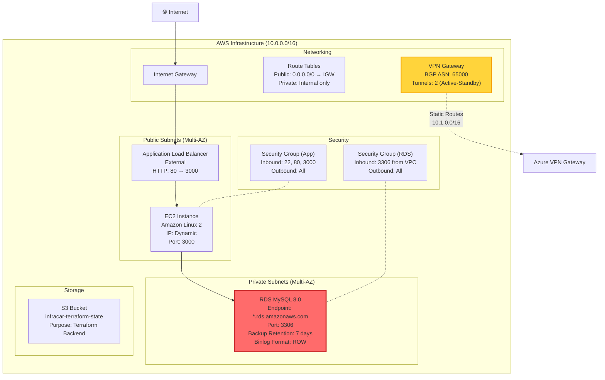
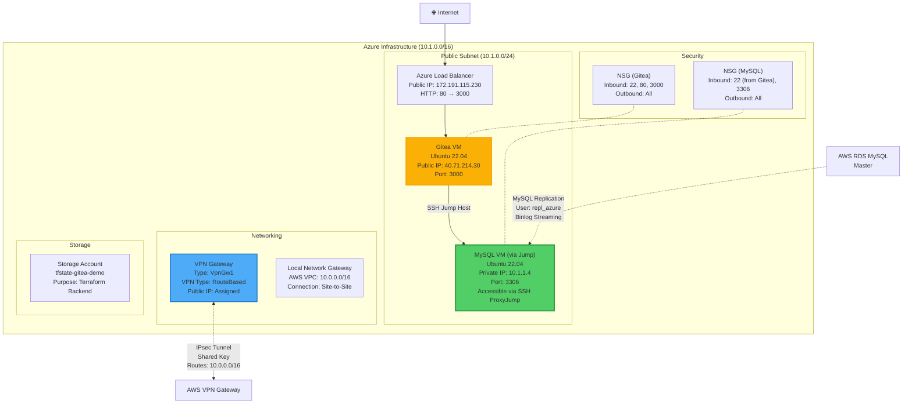
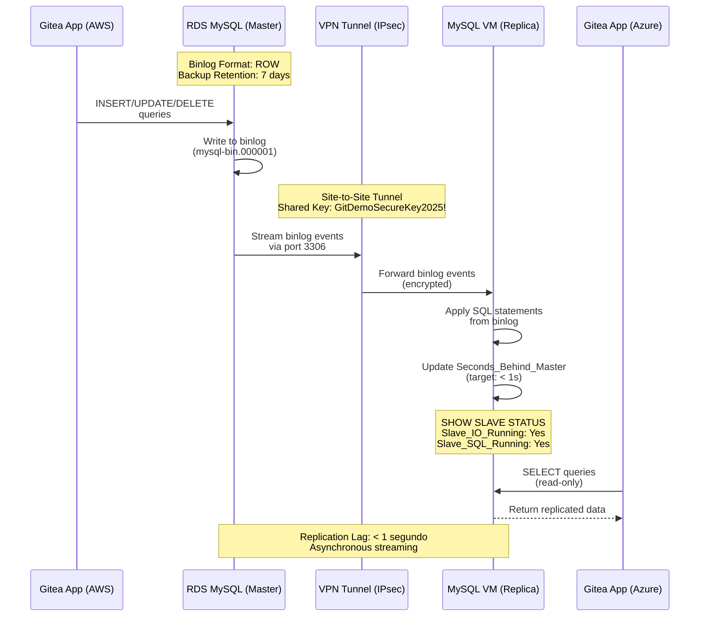
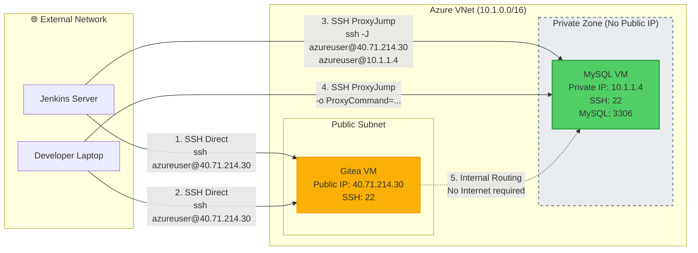
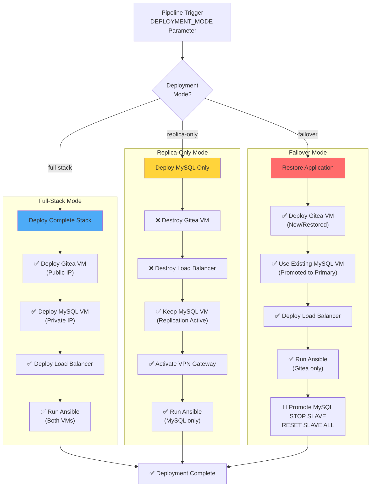

# Gitea Multi-Cloud Disaster Recovery Infrastructure

## Resumen Ejecutivo

Este proyecto implementa una **arquitectura multi-nube de alta disponibilidad** para Gitea (servicio Git self-hosted) con capacidades de disaster recovery mediante replicación MySQL entre AWS y Azure. La solución demuestra prácticas modernas de DevOps, Infrastructure as Code (IaC), CI/CD automatizado, y estrategias de failover cross-cloud.

---

## 🏗️ Arquitectura General del Sistema

### Vista de Alto Nivel: Multi-Cloud Infrastructure

Esta vista de alto nivel muestra la **arquitectura completa del proyecto multi-nube**. Jenkins actúa como el plano de control central, orquestando deployments independientes en AWS (sitio primario) y Azure (sitio de disaster recovery). La conexión entre ambos clouds se realiza mediante un **túnel VPN site-to-site IPsec**, permitiendo que el RDS MySQL en AWS replique datos en tiempo real hacia el MySQL VM en Azure. Las líneas punteadas indican la replicación asíncrona de base de datos, mientras que las líneas sólidas representan conexiones de aplicación normales. Los colores diferencian claramente el master (rojo) del replica (verde).

### Arquitectura Detallada: AWS Infrastructure

La infraestructura AWS implementa una **arquitectura multi-AZ clásica** con separación entre subnets públicas y privadas. El **Application Load Balancer** distribuye tráfico HTTP hacia la instancia EC2 que corre Gitea. El **RDS MySQL está configurado con binlog ROW format** y 7 días de retención de backups, requisitos esenciales para la replicación. El **VPN Gateway con BGP ASN 65000** establece dos túneles redundantes hacia Azure. Los Security Groups implementan el principio de mínimo privilegio, permitiendo solo el tráfico necesario. El bucket S3 almacena el estado remoto de Terraform, permitiendo colaboración en equipo y prevención de conflictos.

### Arquitectura Detallada: Azure Infrastructure

La infraestructura Azure implementa una **arquitectura de seguridad mejorada** donde el MySQL VM **no tiene IP pública**, solo accesible mediante **SSH Jump Host** a través del Gitea VM. Esta configuración reduce significativamente la superficie de ataque. El **VPN Gateway tipo VpnGw1** utiliza enrutamiento basado en rutas (RouteBased) para mayor flexibilidad. El **Azure Load Balancer** (IP pública: 172.191.115.230) funciona como punto de entrada único para el tráfico HTTP. Los **Network Security Groups (NSG)** controlan el tráfico a nivel de VM, permitiendo solo conexiones específicas. El Storage Account de Azure almacena el estado de Terraform, equivalente al S3 de AWS pero con integración nativa de Azure.

### Flujo de Replicación MySQL (AWS → Azure)

Este diagrama de secuencia ilustra el **flujo completo de replicación MySQL** desde AWS hacia Azure. Cuando la aplicación Gitea ejecuta operaciones de escritura (INSERT/UPDATE/DELETE) en el RDS Master, estas se registran en el **binlog con formato ROW**, que captura los cambios a nivel de fila. El binlog se transmite de forma continua a través del **túnel VPN IPsec encriptado** (puerto 3306) hacia el MySQL replica en Azure. El replica aplica estos cambios de forma asíncrona, manteniendo un lag objetivo de **menos de 1 segundo**. Los comandos `SHOW SLAVE STATUS` permiten monitorear la salud de la replicación verificando que ambos threads (IO y SQL) estén corriendo. La aplicación Gitea en Azure puede leer del replica para distribuir carga o estar en standby para failover.

### Arquitectura de Red con SSH Jump Host (Azure)

Este diagrama explica la **arquitectura SSH Jump Host (Bastion Host)** implementada en Azure para acceso seguro. El MySQL VM se encuentra en una **zona privada sin IP pública** (indicada por el área sombreada), accesible únicamente a través del Gitea VM que actúa como jump host. Jenkins y desarrolladores primero establecen conexión SSH al Gitea VM (paso 1-2), y luego utilizan **SSH ProxyJump** (opción `-J`) para saltar al MySQL VM (paso 3-4). El comando completo sería: `ssh -J azureuser@40.71.214.30 azureuser@10.1.1.4`. Ansible utiliza el parámetro `ansible_ssh_common_args` con `ProxyCommand` para automatizar este proceso. Esta arquitectura elimina la necesidad de IPs públicas en bases de datos, reduciendo costos (no se consumen IPs del quota) y mejorando la seguridad (sin exposición directa a Internet).

### Deployment Modes en Azure

El pipeline de Azure implementa **tres modos de deployment flexibles** controlados por el parámetro `DEPLOYMENT_MODE` en Jenkins:

- **Full-Stack (Azul)**: Despliega la infraestructura completa ideal para demos o entornos de desarrollo. Incluye Gitea VM con IP pública, MySQL VM privada, Load Balancer, y ejecuta Ansible en ambas VMs para configuración completa.

- **Replica-Only (Amarillo)**: Destruye la capa de aplicación (Gitea VM y Load Balancer) pero mantiene el MySQL VM activo como replica de AWS. Activa el VPN Gateway para replicación continua. Este modo es útil para reducir costos manteniendo solo la capacidad de disaster recovery.

- **Failover (Rojo)**: Modo de recuperación ante desastres. Despliega nueva Gitea VM y Load Balancer, pero utiliza el MySQL VM existente que ya contiene datos replicados. Ejecuta `STOP SLAVE` y `RESET SLAVE ALL` para promover el replica a primario. El RTO (Recovery Time Objective) es de aproximadamente 10-15 minutos.

---
