# Resumen Ejecutivo Final

---

!!! note ""
    

    <h2 style="color: #3498DB; font-size: 1.8em; margin: 0.5em 0; font-weight: 600;">
    🚀 PROJECT OVERVIEW
    </h2>
    

This project demonstrates a **fully functional multi-cloud disaster recovery architecture** with:

- ✅ **4 integrated Git repositories** with Terraform + Ansible
- ✅ **2 independent Jenkins servers** (AWS + Azure)
- ✅ **Cross-cloud MySQL replication** (AWS RDS → Azure MySQL)
- ✅ **Site-to-Site IPsec VPN** between clouds
- ✅ **RTO: ~20 minutes | RPO: < 1 second**

!!! info ""
    

    <h2 style="color: #9B59B6; font-size: 1.8em; margin: 0.5em 0; font-weight: 600;">
    🛠️ TECHNOLOGY STACK
    </h2>
    

- **Infrastructure**: Terraform (AWS + Azure)
- **Configuration**: Ansible (automation)
- **CI/CD**: Jenkins (independent pipelines)
- **Database**: MySQL 8.0 (binlog replication)
- **Network**: VPN IPsec (secure communication)

!!! example ""
    

    <h2 style="color: #E67E22; font-size: 1.8em; margin: 0.5em 0; font-weight: 600;">
    🌐 MULTI-CLOUD ARCHITECTURE

```mermaid
graph TB
    subgraph "Technology Stack"
        subgraph "Infrastructure Layer"
            Terraform["🏗️ Terraform<br/>Infrastructure as Code"]
            Ansible["⚙️ Ansible<br/>Configuration Management"]
        end
        
        subgraph "CI/CD Layer"
            JenkinsAWS["🤖 Jenkins AWS<br/>Primary Automation"]
            JenkinsAZ["🤖 Jenkins Azure<br/>DR Automation"]
        end
        
        subgraph "Application Layer"
            GiteaAWS["📦 Gitea AWS<br/>Primary Service"]
            GiteaAZ["📦 Gitea Azure<br/>Standby Service"]
        end
        
        subgraph "Data Layer"
            MySQLAWS["🗄️ MySQL AWS<br/>Master Database"]
            MySQLAZ["🗄️ MySQL Azure<br/>Replica Database"]
        end
        
        subgraph "Network Layer"
            VPN["🔒 IPsec VPN<br/>Secure Tunnel"]
        end
    end
    
    Terraform --> JenkinsAWS
    Terraform --> JenkinsAZ
    Ansible --> GiteaAWS
    Ansible --> GiteaAZ
    JenkinsAWS --> GiteaAWS
    JenkinsAZ --> GiteaAZ
    GiteaAWS --> MySQLAWS
    GiteaAZ --> MySQLAZ
    MySQLAWS -.->|"Replication"| VPN
    VPN -.-> MySQLAZ
    
    classDef infra fill:#9b59b6,stroke:#8e44ad,stroke-width:2px,color:#fff
    classDef cicd fill:#e67e22,stroke:#d35400,stroke-width:2px,color:#fff
    classDef app fill:#3498db,stroke:#2980b9,stroke-width:2px,color:#fff
    classDef data fill:#e74c3c,stroke:#c0392b,stroke-width:2px,color:#fff
    classDef network fill:#34495e,stroke:#2c3e50,stroke-width:2px,color:#fff
    
    class Terraform,Ansible infra
    class JenkinsAWS,JenkinsAZ cicd
    class GiteaAWS,GiteaAZ app
    class MySQLAWS,MySQLAZ data
    class VPN network
```

    </h2>
    

!!! success ""
    

    <h2 style="color: #27AE60; font-size: 1.8em; margin: 0.5em 0; font-weight: 600;">
    📂 REPOSITORIES
    </h2>
    

| **Repository** | **Technology** | **Purpose** |
|----------------|----------------|-------------|
| [tf-infra-demoGitea](https://github.com/andreaendigital/tf-infra-demoGitea) | Terraform | AWS Infrastructure |
| [ansible-demoGitea](https://github.com/andreaendigital/ansible-demoGitea) | Ansible | AWS Configuration |
| [tf-az-infra-demoGitea](https://github.com/andreaendigital/tf-az-infra-demoGitea) | Terraform | Azure Infrastructure |
| [ansible-az-demoGitea](https://github.com/andreaendigital/ansible-az-demoGitea) | Ansible | Azure Configuration |

---

*Last Updated: {{ git_revision_date_localized }}*